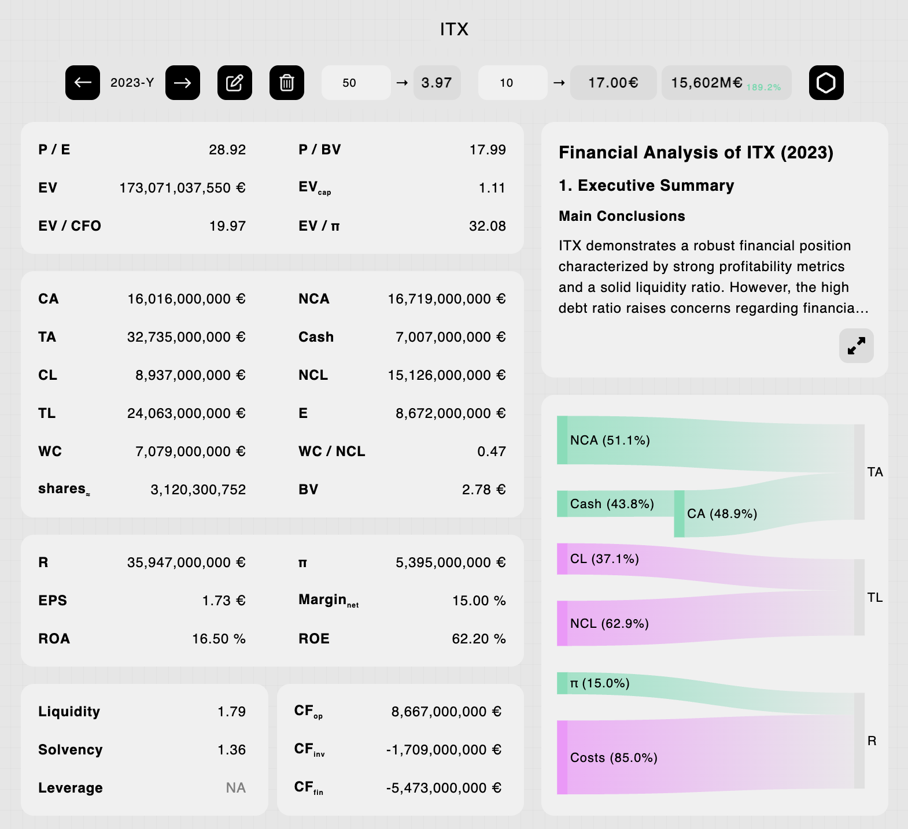

## pre_intrinsic_prod

The inspiration for the open-source app:
[intrinsic](https://github.com/alwaysvitorious/intrinseco).

A production-ready website that never made it to production (no time,
questionable PMF).

- AWS, Go, Vue, Javascript, D3, Terraform, Bash, Stripe, OpenAI...
- Full-stack monolith HTTP server on EC2, CI/CD with full redeployment or
  blue/green options, authentication, payments/paywall, serverless NoSQL,
  server/browser caches, responsive SPA...

---

  

---
